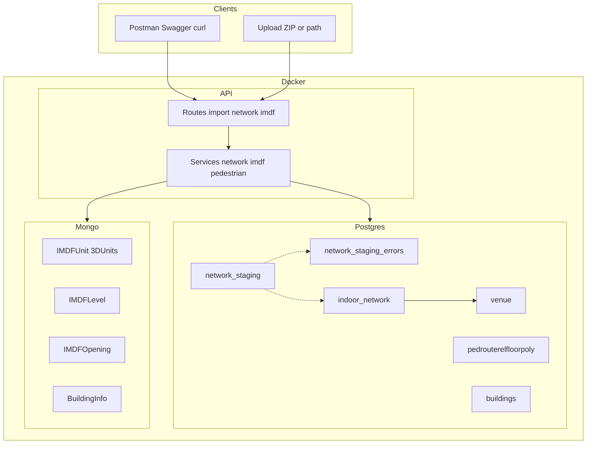
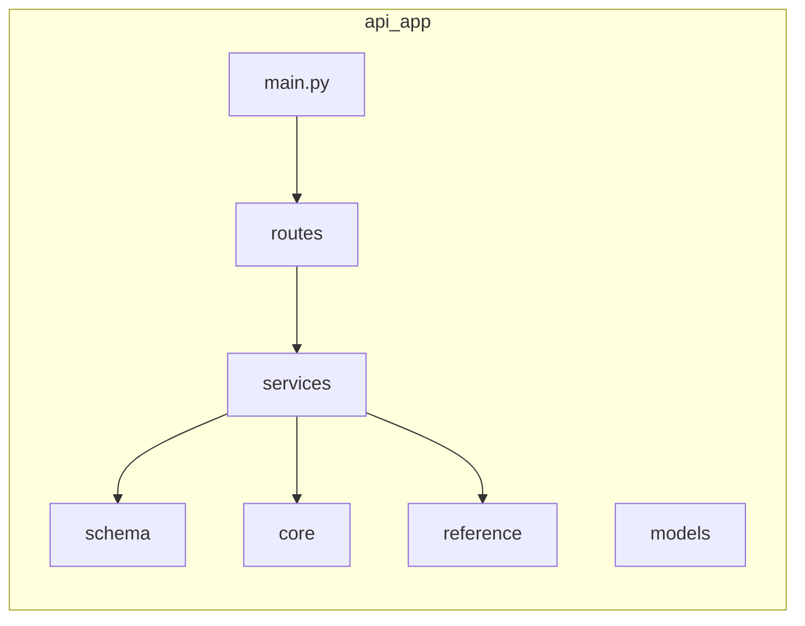
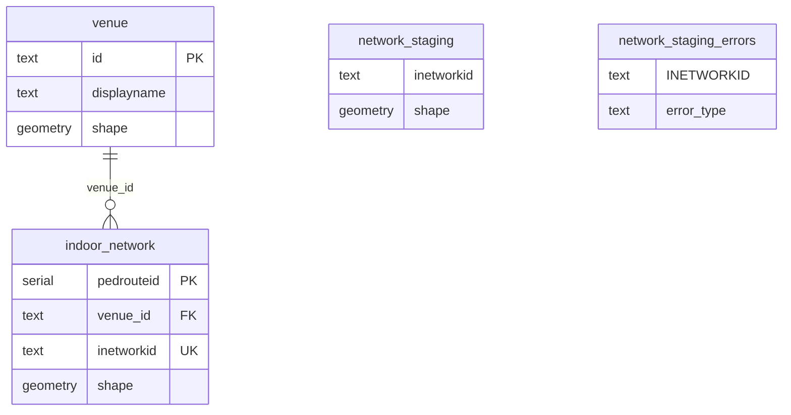
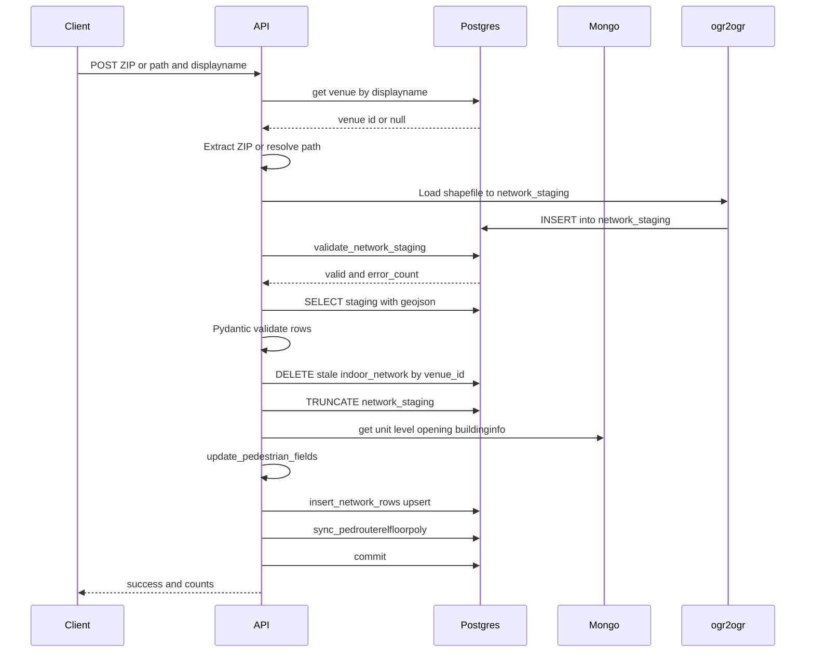

# Network DB – Project Structure & Architecture

This document describes the **Indoor GIS / Network DB** project: structure, system architecture, database schema, workflow, and recommendations. It is intended for senior review and onboarding.

---

## 1. Project Overview

**Purpose:** Ingest 3D indoor network shapefiles, validate them, enrich with IMDF data (units, levels, openings, building info), and persist the result into PostgreSQL/PostGIS. Venue metadata is stored in Postgres; unit, level, opening, and related IMDF layers are currently in MongoDB and will be migrated to Postgres later.

**Stack:**

- **API:** FastAPI (Python), running in Docker
- **Database:** PostgreSQL + PostGIS (EPSG:2326 for network/venue geometry)
- **IMDF / reference data:** MongoDB (IndoorMap DB) – unit, 3D unit, level, 3D floor, opening, 3D gates, BuildingInfo
- **Build/run:** `docker compose -f docker-compose.yml -f docker-compose.dev.yml up --build`

**Key workflows:**

- Import network from **ZIP upload** or **folder path** (relative to mounted `/data`)
- Validate staging geometry (SRID 2326, 3D, no duplicates)
- Enrich rows using MongoDB IMDF data + Postgres venue
- Upsert into `indoor_network`; sync `pedrouterelfloorpoly` from levels
- Export `indoor_network` by displayname to shapefile (ogr2ogr)

---

## 2. Why Python (Shapely) over Node.js (Turf)

Data is in **EPSG:2326** (Hong Kong 1980 Grid) and stored in **PostGIS**. The API must work with points, linestrings, and polygons—splitting, merging, and creating new geometries—and use **ogr2ogr** to import data into PostgreSQL. For this workflow, **Python with Shapely** is the stronger choice than Node.js with Turf.

**Why Python (Shapely) fits:** (1) **CRS:** Shapely defers projection to PyProj/Fiona/GDAL; data can stay in 2326 with no unnecessary reprojection. Turf is WGS84-only; using 2326 requires constant reprojection and adds error/overhead. (2) **Performance:** Shapely 2.0+ has STRtree and vectorized ops; Turf has no spatial indexing and can be slow at scale. (3) **Mixed geometry:** Shapely/GEOS handles points, lines, and polygons robustly; Turf has dimension restrictions and brittle edge cases. (4) **ETL/ogr2ogr:** Python fits the GDAL ecosystem (Fiona, GeoPandas, `to_postgis()`); Node has no native GDAL bindings and typically shells out to ogr2ogr via temp files.

**Comparison (summary):** Python supports 2326 natively (via PyProj/Fiona), has STRtree and vectorized performance, full GEOS predicates, and direct GDAL/PostGIS integration. Node/Turf is WGS84-only, no spatial index, CLI-only ogr2ogr, and manual PostGIS ingestion. **Pros/cons:** Python—pros: 2326 + GDAL pipeline, performance, mixed geometry; cons: different language if stack is Node, buffer may drop Z. Node/Turf—pros: single language if API is Node, modular packages; cons: no 2326, no indexing, GeoJSON lock-in, fragile ogr2ogr workflow.

**Architecture in this project:** ETL via ogr2ogr (or Fiona) in EPSG:2326; geometry engine Shapely 2.0+; API FastAPI; PostGIS load via GeoPandas `to_postgis()` or ogr2ogr. See **PROJECT_STRUCTURE.html** for the full comparison table and detailed rationale.

---

## 3. System Architecture

High-level components and data flow:



**Data flow (import):**

1. Client sends ZIP or folder path + displayname to API.
2. API checks **venue** in Postgres by displayname (early validation).
3. Shapefile is loaded into **network_staging** (ogr2ogr).
4. **validate_network_staging()** runs (geometry, SRID, 3D, duplicates); errors go to **network_staging_errors**.
5. Staging rows are read, validated with Pydantic (**NetworkStagingRow**), then enriched using **MongoDB** (units, levels, openings, BuildingInfo) and **Postgres** (venue_id).
6. Rows are upserted into **indoor_network**; **pedrouterelfloorpoly** is synced from IMDF levels.

---

## 4. Folder Structure

### 4.1 Repository root

```
network-db/
├── api/                    # FastAPI application
│   ├── app/
│   │   ├── core/           # Config, DB, MongoDB, middleware, logging
│   │   ├── main.py         # FastAPI app, CORS, routers
│   │   ├── models/         # ORM-style models (network, opening, unit)
│   │   ├── reference/      # pedestrian_convert_table.json, swagger.yaml
│   │   ├── routes/         # import_routes, network_routes, imdf_routes, pedestrian
│   │   ├── schema/         # Pydantic schemas (network, opening, unit)
│   │   └── services/       # Business logic: network_services, imdf_service, pedestrian_service, utils
│   ├── Dockerfile
│   └── requirements.txt
├── SQL/
│   └── new_db/
│       ├── venue_table.sql
│       ├── network_table_list.sql
│       └── pedestrian._table._list.sql
├── data/                   # Mounted as /data in container (shapefiles, examples)
├── docs/                   # This documentation
├── docker-compose.yml
├── docker-compose.dev.yml
└── ...
```

### 4.2 API folder (focus)



| Path           | Role                                                                                                                                                                                                                                                                                                                                                                                 |
| -------------- | ------------------------------------------------------------------------------------------------------------------------------------------------------------------------------------------------------------------------------------------------------------------------------------------------------------------------------------------------------------------------------------ |
| **main.py**    | Creates FastAPI app, mounts CORS, request-context middleware, global exception handler; includes routers (system, import_routes, imdf_routes, network_routes, pedestrian).                                                                                                                                                                                                           |
| **core/**      | `config.py` (Postgres + MongoDB URLs), `database.py` (SessionLocal), `mongodb.py` (Motor client → IndoorMap), `logger.py`, `middleware.py`, `error_handlers.py`, `dependencies.py`.                                                                                                                                                                                                  |
| **routes/**    | HTTP endpoints: import (ZIP, path, venues), network (export indoor_network), imdf (Mongo/IMDF by displayName), pedestrian, system.                                                                                                                                                                                                                                                   |
| **services/**  | `network_services.py` (import pipeline, validation, enrichment, indoor_network upsert), `imdf_service.py` (venue from Postgres, IMDF from Mongo, flpolyid_slices), `pedestrian_service.py` (wc_access, alias names, insert_network_rows_into_indoor_network, sync_pedrouterelfloorpoly), `utils.py` (geometry, feattype), `validation.py`, `mongo_service.py` (find by displayName). |
| **schema/**    | Pydantic models for validation (e.g. **NetworkStagingRow** aligned with indoor_network and pedestrian_convert_table).                                                                                                                                                                                                                                                                |
| **models/**    | Additional model definitions (network, opening, unit).                                                                                                                                                                                                                                                                                                                               |
| **reference/** | `pedestrian_convert_table.json` (DB ↔ shapefile ↔ GeoJSON field mapping), `swagger.yaml`.                                                                                                                                                                                                                                                                                            |

---

## 5. Database Schema

Tables are created from the SQL files under `SQL/new_db/`.

### 5.1 Entity relationship (high level)



### 5.2 Venue (`venue_table.sql`)

| Column                                                                    | Type                     | Description                  |
| ------------------------------------------------------------------------- | ------------------------ | ---------------------------- |
| id                                                                        | TEXT PK                  | Venue identifier (from IMDF) |
| displayname                                                               | TEXT                     | e.g. `KLNE_45_...`           |
| name_en, name_zh                                                          | TEXT                     | Names                        |
| category, restriction, hours, website, phone, address_id, organization_id | TEXT                     | Optional metadata            |
| building_type                                                             | TEXT[]                   | e.g. ["EDB"]                 |
| region                                                                    | TEXT                     | e.g. KLNE                    |
| shape                                                                     | GEOMETRY(Geometry, 2326) | 2D polygon/multipolygon      |
| display_point                                                             | GEOMETRY(Point, 2326)    | 2D point                     |
| created_at, updated_at                                                    | TIMESTAMP                | HK timezone                  |

Venue is used for early import validation (displayname must exist) and as FK in `indoor_network` (`venue_id`).

### 5.3 Network staging & validation (`network_table_list.sql`)

- **network_staging:** Populated by **ogr2ogr** from the shapefile. Schema follows the shapefile (e.g. INETWORKID, shape, highway, oneway, …). Not created in the SQL file; ogr2ogr creates/replaces it with `-nln public.network_staging`.
- **network_staging_errors:** Holds validation errors (INETWORKID, error_type, error_message).
- **validate_network_staging():** PL/pgSQL function that:
  - Clears `network_staging_errors`
  - Checks geometry NULL, invalid geometry, wrong SRID (must be 2326), not 3D, INETWORKID NULL, duplicate INETWORKID
  - Returns JSON `{ "valid": boolean, "error_count": number }`

### 5.4 Indoor network (`network_table_list.sql`)

**indoor_network** is the main table for processed network lines (aligned with `api/app/schema/network.py`):

- **Keys:** `pedrouteid` SERIAL PK, `inetworkid` UNIQUE, `venue_id` FK → venue(id)
- **Geometry:** `shape` GEOMETRY(LineStringZ, 2326)
- **Attributes:** displayname, highway, oneway, emergency, wheelchair, flpolyid, feattype, floorid, location, gradient, wc_access, wc_barrier, direction, bldgid_1/2, aliasnamen/aliasnamtc, level_id, buildnamen/zh, leveleng/zh, mainexit, etc.
- **Triggers:** `update_shape_len()` (ST_3DLength), `log_indoor_network_changes()` (history), `set_updated_at()`

**indoor_network_history** stores previous versions of rows on UPDATE/DELETE.

Other objects in the same file: **pedrouterelfloorpoly**, **buildings**, and supporting triggers/functions.

### 5.5 Pedestrian (`pedestrian._table._list.sql`)

- **pedestrian_staging:** Staging table for pedestrian import (shape + attribute columns).
- **pedestrian_network:** Main pedestrian network table (pedrouteid PK, shape LineStringZ 2326, feattype, floorid, wc_access, etc.).
- **pedestrian_network_history:** Audit log for updates/deletes.
- Triggers: length calculation, history logging, updated_at.

---

## 6. API Structure & Workflow

### 6.1 Routes summary

| Method        | Path                       | Purpose                                                                       |
| ------------- | -------------------------- | ----------------------------------------------------------------------------- |
| GET           | /                          | Health                                                                        |
| POST          | /import-venues             | Migrate venues from MongoDB → Postgres venue table                            |
| POST          | /import-network-upload/    | Upload one or more ZIPs; displayname from filename; runs full import pipeline |
| POST          | /import-network-from-path/ | Import from folder path (relative to IMPORT_BASE_PATH, e.g. /data)            |
| POST          | /import-network/           | Hardcoded displayName + path (dev/convenience)                                |
| GET           | /export-indoor-network/    | Export indoor_network by displayname to shapefile (ogr2ogr)                   |
| (imdf_routes) | e.g. by displayName        | Fetch unit, level, opening, BuildingInfo, etc. from MongoDB                   |

### 6.2 Import workflow (process flow)

Process flow (same as flowchart in PROJECT_STRUCTURE.html):

1. **Start:** Submit / upload network data.
2. **Venue found?** — **No** → Return 400, stop. **Yes** → continue.
3. **Load shapefile to staging** (ogr2ogr).
4. **Staging valid?** — **No** → Corrective action / return errors (network_staging_errors) → Stop (no write to main table). **Yes** → continue.
5. **Read staging,** Pydantic validate, **enrich** (Mongo + Postgres).
6. **Upsert indoor_network.**
7. **Sync pedrouterelfloorpoly.**
8. **End:** Import complete.

**User edits (QGIS, OpenLayers, Cesium):** When users edit **indoor_network** directly from these tools, the same trigger **log_indoor_network_changes()** runs on UPDATE/DELETE and appends the old row to **indoor_network_history**. No separate application logic is required; the DB captures all edits regardless of client.

### 6.2.1 Import workflow (sequence diagram)



### 6.2.2 Export Workflow

Export reads from **indoor_network** by venue **displayname** and writes Shapefile and/or GeoJSON via ogr2ogr. Endpoints: **GET /export-indoor-network/** (displayname, export_type, export_format, output_dir) writes to a path and returns JSON; **GET /download-indoor-network-zip/** (displayname, type, opendata) exports both SHP and GeoJSON to temp dirs, zips them, and streams the ZIP. The service **export_indoor_network_by_displayname()** loads **pedestrian_convert_table.json** for field mapping, builds SQL filtered by displayname (and restricted='N' when opendata=open), runs ogr2ogr (Shapefile in 2326, GeoJSON transformed to 4326). No staging; export is read-only from the main table.

### 6.2.3 API interface: Swagger

The interface for **import** and **export** is described in **api/app/reference/swagger.yaml**. Users use this OpenAPI definition (or the served Swagger UI) to call the endpoints. **Import:** POST /import-network-upload/ (multipart files = ZIPs; display name from filename). **Export:** GET /download-indoor-network-zip/ (query: displayname, type, opendata). The same swagger.yaml documents other Indoor API paths (checkSubmission, duplicateCheck, download/groupBuildingInfo, etc.); for network import and export, the two paths above are the ones used.

### 6.3 Program logic (core services)

- **network_services.py**
  - **process_network_import(displayName, filePath):** Venue check → truncate staging → ogr2ogr → validate_network_staging() → read staging → Pydantic validate → sync delete (indoor_network by venue_id) → split rows (pedrouteid 0 vs not) → update_pedestrian_fields (for rows to calculate) → insert_network_rows_into_indoor_network → sync_pedrouterelfloorpoly_from_imdf → commit.
  - **process_network_import_from_zip:** Temp dir → extract ZIP → find folder containing `3D Indoor Network.shp` → call process_network_import.
  - **process_network_import_from_folder_path:** Resolve path under IMPORT_BASE_PATH (security: no `..`) → process_network_import.
  - **update_pedestrian_fields:** Fetches unit, 3D unit, level, buildingInfo, opening, openings-with-name from MongoDB; maps flpolyid → level_id, buildingCSUID, floorNumber; computes feattype (utils.calculate_feature_type), wc_access (pedestrian_service.calculate_wheelchair_access), alias names (get_alias_name); sets floorid, bldgid_1, buildingnameeng/chi, level names, etc.

- **imdf_service.py**
  - **get_venue_by_displayName:** Reads from **Postgres** venue table (get_venue_by_displayName_from_postgres).
  - **get_unit_by_displayName, get_level_by_displayName, get_opening_by_displayName, get_buildinginfo_by_displayName,** etc.: Read from **MongoDB** (find_one_by_display_name / find_records_by_display_name).
  - **import_all_venues_to_postgis:** One-off migration of IMDFVenue from MongoDB → Postgres venue table (with coordinate transform to 2326).
  - **flpolyid_slices(flpolyid):** Returns (buildingCSUID, floorNumber) from flpolyid string.

- **pedestrian_service.py**
  - **calculate_wheelchair_access:** Ramp (feattype 11) and intersection with buffered openings (same level).
  - **get_alias_name:** Alias names from building/level/exit and facility map (FACILITY_MAP).
  - **insert_network_rows_into_indoor_network:** Converts GeoJSON → WKT, upserts into indoor_network (ON CONFLICT inetworkid).
  - **sync_pedrouterelfloorpoly_from_imdf:** Levels from MongoDB → upsert pedrouterelfloorpoly.

- **utils.py**
  - **calculate_feature_type:** Intersection of staging line (transformed to 4326) with unit/3D unit features; maps category to feattype (walkway, escalator, lift, ramp, etc.).
  - Geometry helpers: \_line_from_geojson, \_transform_2326_to_4326, \_force_2d.

---

### 6.4 Staging → main table → history (network and pedestrian)

Data is **never imported directly into history tables**. History is written automatically by database triggers when rows in the **main** table are updated or deleted.

#### Network data flow

1. **Staging:** The shapefile is loaded into **network_staging** by ogr2ogr (one-time load per import). Columns (e.g. INETWORKID, shape, highway, oneway, flpolyid) come from the shapefile. The table is truncated before each new run so each import starts from a clean staging state.
2. **Validation:** The PL/pgSQL function **validate_network_staging()** runs against network_staging. It checks geometry NOT NULL, ST_IsValid, SRID = 2326, ST_NDims = 3, INETWORKID NOT NULL, and no duplicate INETWORKID. Any failures are inserted into **network_staging_errors** and the function returns `{ "valid": false, "error_count": n }`. If invalid, the API returns these errors and does **not** move data to the main table.
3. **Main table:** After validation passes, the application reads rows from network_staging, validates them with Pydantic (NetworkStagingRow), enriches them (feattype, wc_access, alias names, level_id, floorid, etc.) using MongoDB and Postgres, then **upserts** into **indoor_network** (ON CONFLICT inetworkid). Staging is then truncated. So the only table that receives the “final” network rows is **indoor_network**.
4. **History:** The table **indoor_network_history** is populated **only by a trigger** on **indoor_network**: before any UPDATE or DELETE, the trigger **log_indoor_network_changes()** inserts the **old** row (before the change) into indoor_network_history with an operation type ('UPDATE' or 'DELETE'). There is no separate “import into history”; history is an audit trail of changes to the main table.

#### Pedestrian data flow

1. **Staging:** Pedestrian data is loaded into **pedestrian_staging** from a File Geodatabase (FGDB) via ogr2ogr (layer PedestrianRoute, -nln pedestrian_staging, -t_srs EPSG:2326). Columns (e.g. PedestrianRouteID, shape, FeatureType, FloorID) come from the FGDB.
2. **Main table:** The application runs **merge_staging_to_production(staging_table)** which uses **pedestrian_convert_table.json** to map staging columns to **pedestrian_network** columns. It performs an **UPSERT** (INSERT ... ON CONFLICT (pedrouteid) DO UPDATE) from pedestrian_staging into **pedestrian_network**, then a **DELETE** from pedestrian_network for pedrouteids that are not in the current staging. So the main table for pedestrian routes is **pedestrian_network**; there is no “import into history” step.
3. **History:** **pedestrian_network_history** is filled **only by a trigger** on **pedestrian_network**: before UPDATE or DELETE, the trigger **log_pedestrian_network_changes()** inserts the old row into pedestrian_network_history. Again, history is purely an audit of changes to the main table.

Summary: **Staging is the landing zone for raw import; the main table (indoor_network or pedestrian_network) is the target of processed data; history tables are append-only audit logs maintained by triggers on the main table.**

#### Why use triggers for history?

Users edit **indoor_network** from multiple tools: **QGIS**, **OpenLayers**, **Cesium**, and other custom applications. Because many users may edit the same data **concurrently**, the system cannot rely on a single application to write history. The **database** must automatically record changes whenever rows are updated or deleted, regardless of which client (QGIS, API, or another app) performed the edit. Triggers on **indoor_network** (and **pedestrian_network**) ensure that every change is logged to the corresponding history table without requiring each application to implement history logic.

This network-db import API is **one part** of the system; there are other applications for editing **units**, **openings**, and **points**. You can refer to each deployable, bounded-capability component (this API, the QGIS workflow, the OpenLayers/Cesium editors, etc.) as a **service** or **microservice** if that fits your architecture vocabulary. The important point: the history trigger lives in the **database**, so it is **application-agnostic** and correctly captures edits from any client.

---

### 6.5 Logic for calculating each network (geometry and derived fields)

This section describes how **geometry** is used and how each **derived field** is computed for a network row (indoor network import pipeline).

#### Source of geometry

- The **shape** of each network segment comes from the shapefile. ogr2ogr loads it into **network_staging** as a PostGIS geometry column: **LineStringZ**, **SRID 2326** (Hong Kong 1980 Grid).
- In the application, the row is read with **ST_AsGeoJSON(shape) AS geojson**, so each row has a **geojson** string (coordinates in 2326). The geometry is **not** modified; it is only **read** for spatial calculations and later written to **indoor_network** (via WKT from the same GeoJSON).

#### How each derived field is calculated

| Field                                          | Logic                                                                                                                                                                                                                                                                                                                                                                                                                                                                                                                                                                                          |
| ---------------------------------------------- | ---------------------------------------------------------------------------------------------------------------------------------------------------------------------------------------------------------------------------------------------------------------------------------------------------------------------------------------------------------------------------------------------------------------------------------------------------------------------------------------------------------------------------------------------------------------------------------------------- |
| **level_id**                                   | Level features (MongoDB, get_level_by_displayName) are iterated; each has properties.FloorPolyID. For each staging row, if **row.flpolyid** equals a level’s FloorPolyID, that level’s **id** is assigned to **row.level_id**. So level_id links the segment to an IMDF level.                                                                                                                                                                                                                                                                                                                 |
| **floorid**                                    | **flpolyid_slices(flpolyid)** returns (buildingCSUID, floorNumber). BuildingInfo (MongoDB, by displayName) is searched for the matching **buildingCSUID**. From that document, **SixDigitID** and **floorNumber** (from slices) are combined: **floorid = SixDigitID + floorNumber** (e.g. integer 1009790001).                                                                                                                                                                                                                                                                                |
| **bldgid_1, buildingnameeng, buildingnamechi** | From the same BuildingInfo document: **BuildingID**, **Name_EN**, **Name_CH**.                                                                                                                                                                                                                                                                                                                                                                                                                                                                                                                 |
| **levelenglishname, levelchinesename**         | From the level feature (already matched by flpolyid): **properties.name.en**, **properties.name.zh**.                                                                                                                                                                                                                                                                                                                                                                                                                                                                                          |
| **feattype**                                   | **calculate_feature_type(row, unit_features, unit3d_features)** in utils.py: (1) Build a **LineString** from row.geojson (2326). (2) Transform is used\*\*: line–polygon intersection in 4326.                                                                                                                                                                                                                                                                                                                                                                                                 |
| **gradient**                                   | **calculate_gradient(geojson)** in utils: from the 3D line’s coordinates, compute **vertical change (delta Z)** and **horizontal length** (planar distance in 2326). Gradient is the **angle** (e.g. atan2(z_delta, horizontal_length)). So geometry (Z values and XY length) drives the value.                                                                                                                                                                                                                                                                                                |
| **wc_access**                                  | **calculate_wheelchair_access(row, opening_features)** in pedestrian_service: If **feattype != 11** (ramp), return **2**. Otherwise: (1) Get row’s **line** from geojson, transform to 4326. (2) Filter **opening_features** (from MongoDB, same displayName) to the same **level_id**. (3) For each opening (LineString), create a **0.1 m buffer** (in degrees ~0.1/111320). (4) If the row’s line **intersects** any such buffer, return **1**, else **2**. So geometry is used: line–buffered-opening intersection.                                                                        |
| **wc_barrier**                                 | Business rule: **1** if feattype is 8 (escalator) or 12 (stairs) or wheelchair == 'no'; else **2**. No geometry.                                                                                                                                                                                                                                                                                                                                                                                                                                                                               |
| **direction**                                  | From **oneway**: 'no' → 0, 'reverse' → -1, 'yes' → 1. No geometry.                                                                                                                                                                                                                                                                                                                                                                                                                                                                                                                             |
| **emergency**                                  | **'no'** if feattype == 10 (lift), else **'yes'**. No geometry.                                                                                                                                                                                                                                                                                                                                                                                                                                                                                                                                |
| **aliasnamen, aliasnamtc**                     | **get_alias_name(row, opening_features_with_name)** in pedestrian_service: (1) Get row line (geojson → 4326). (2) Filter openings to same level_id and **name not null**. (3) If the line **intersects** the 0.1 m buffer of an opening, use that opening’s **name.en / name.zh** plus building name and **facility type name** (FACILITY_MAP from feattype) to build alias strings. (4) If no intersecting opening, use building name + facility name or level name. Chinese alias: spaces removed. So geometry is used: line–buffered-opening intersection to pick the “exit” for the label. |
| **shape_len**                                  | Not computed in the application. The **indoor_network** table has a trigger **update_shape_len()** that sets **shape_len = ST_3DLength(shape)** on INSERT/UPDATE. So geometry length is computed in PostGIS.                                                                                                                                                                                                                                                                                                                                                                                   |

In short: **geometry** (LineStringZ, 2326) is read from staging, transformed to 4326 where needed for spatial comparisons with MongoDB-sourced units/openings, and used to compute **feattype** (intersection with units), **wc_access** and **alias names** (intersection with buffered openings), and **gradient** (Z and length). **level_id**, **floorid**, and building/level names come from **flpolyid** and lookups in level and BuildingInfo, not from geometry.

---

## 7. Data Sources (Current vs Future)

| Data                                                            | Current                                          | Future (planned)          |
| --------------------------------------------------------------- | ------------------------------------------------ | ------------------------- |
| Venue                                                           | **PostgreSQL** (venue)                           | Stay in Postgres          |
| Indoor network                                                  | **PostgreSQL** (indoor_network, network_staging) | Stay in Postgres          |
| Pedestrian network / pedrouterelfloorpoly                       | **PostgreSQL**                                   | Stay in Postgres          |
| Unit, 3D unit, level, 3D floor, opening, 3D gates, BuildingInfo | **MongoDB** (IndoorMap)                          | Migrate to Postgres later |

Example MongoDB documents (by displayName) are under `data/Hong Kong City Hall/` (e.g. `imdf_unit.json`, `3d_units.json`, `imdf_opeing.json`, `3d gates.json`). They are GeoJSON-like FeatureCollections or docs with a `displayName` field.

---

## 8. Docker & Run

- **Build and run (dev):**  
  `docker compose -f docker-compose.yml -f docker-compose.dev.yml up --build`
- **Base compose:** PostGIS (port 5433→5432), API (8001→8000), env DATABASE_URL, EXPORT_RESULT_DIR=/data/result, IMPORT_BASE_PATH=/data, volume `./data:/data`, extra_hosts for MongoDB host if needed.
- **Dev overlay:** Mounts `./api/app` into container for live reload; debugpy on 5678; uvicorn --reload.

---

## 9. Pros and Cons

### Pros

- **Clear separation:** Routes → services → schema; core (config, DB, Mongo) centralized.
- **Single import pipeline:** Same validation and enrichment for ZIP, path, or hardcoded import.
- **Strong validation:** Postgres (validate_network_staging) + Pydantic (NetworkStagingRow) + early venue check.
- **Audit trail:** indoor_network_history and pedestrian_network_history; sync delete scoped by venue_id.
- **Venue in Postgres:** Enables FK and simple “venue exists?” check without MongoDB for that piece.
- **Reference docs:** pedestrian_convert_table.json and SQL files document schema and field mapping.
- **Dockerized:** One command to run API + PostGIS; dev compose for debugging and hot reload.

### Cons

- **Dual store:** MongoDB still required for unit/level/opening/BuildingInfo; two systems to operate and migrate later.
- **Blocking I/O in async:** Some DB/Mongo calls and ogr2ogr are synchronous; under load, async benefits are limited.
- **Hardcoded / legacy route:** POST /import-network/ uses a fixed path and displayName (good for dev, not for production API contract).
- **network_staging schema:** Defined by ogr2ogr from the shapefile, not by a single CREATE TABLE in the repo; can drift if shapefile schema changes.
- **Error handling:** Some branches return dicts with status/errors; others raise HTTPException; could be unified.

---

## 10. Areas for Improvement

1. **MongoDB → Postgres migration:** Plan and execute migration of unit, level, opening, 3D gates, BuildingInfo to Postgres (tables + ETL + switch imdf_service to Postgres).
2. **Staging table DDL:** Add a canonical `CREATE TABLE network_staging (...)` in SQL/new_db and align ogr2ogr column names (or a migration step) so validation and code always match.
3. **Async consistency:** Use async drivers/sessions for Postgres (e.g. asyncpg) and keep Mongo async; run ogr2ogr in a thread pool so the event loop is not blocked.
4. **API contract:** Remove or restrict the hardcoded /import-network/; make displayname and path (or file) explicit parameters for all import endpoints.
5. **Unified error responses:** Standardize on a single error shape (e.g. status, code, message, details) and use HTTPException with a consistent detail structure.
6. **Tests:** Add unit tests for flpolyid_slices, \_resolve_import_folder_path, and Pydantic schema; integration tests for validate_network_staging and a minimal import (e.g. with a fixture shapefile).
7. **Docs:** Keep this document and the SQL files in sync; add a one-page “Runbook” (order of SQL scripts, env vars, how to run import/export).

---

## 11. Diagram Summary

- **System architecture:** Figure in §2 (flowchart: clients, API, Postgres, MongoDB).
- **API folder structure:** Figure in §3.2 (flowchart: main → routes → services → schema/core/ref).
- **Database ER:** Figure in §4.1 (venue, indoor_network, network_staging, pedrouterelfloorpoly, buildings).
- **Import workflow:** Figure in §5.2 (sequence: client → API → Postgres/Mongo/ogr2ogr through validation, enrichment, upsert, sync).

For senior review, the most important flow is **§5.2 Import workflow** and the **§4 Database schema** aligned with `SQL/new_db/*.sql`. The **§8 Pros and cons** and **§9 Improvements** give a concise assessment and next steps.
